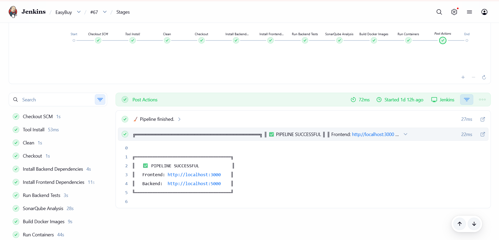
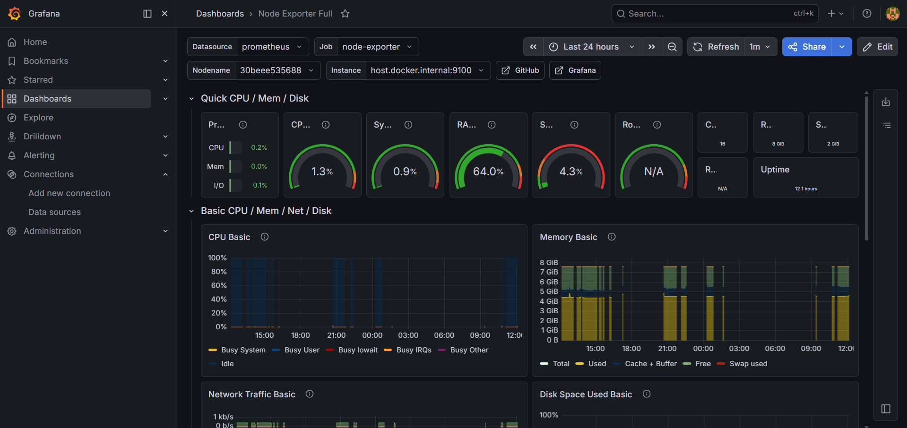
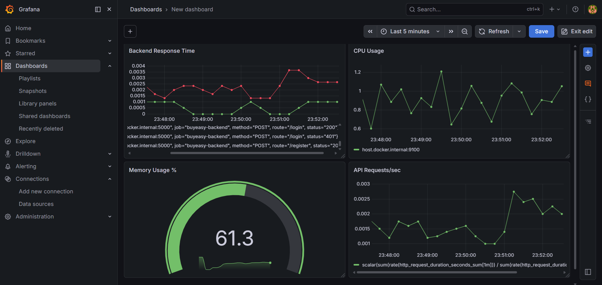
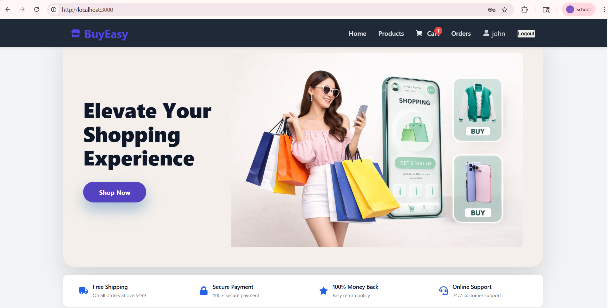

# 🚀 BuyEasy DevOps Project

A production-style full-stack MERN e-commerce application integrated with a complete DevOps pipeline using Docker, Jenkins, SonarQube, Prometheus, and Grafana.

# 📌 Project Overview

BuyEasy is a containerized MERN stack e-commerce platform designed to demonstrate real-world DevOps practices including:

- CI/CD automation using Jenkins
- Docker containerization
- Multi-container orchestration using Docker Compose
- Code quality analysis using SonarQube
- Monitoring and observability using Prometheus and Grafana
- Infrastructure as Code
- Automated deployment pipeline

# 🏗️ System Architecture

Developer Pushes Code to GitHub
            │
            ▼
        Jenkins Pipeline
            │
 ┌──────────┴──────────┐
 │                     │
 ▼                     ▼
SonarQube        Docker Build & Deploy
(Code Quality)          │
                        ▼
             ┌──────────────────────┐
             │ Docker Compose Stack │
             └──────────────────────┘
                        │
 ┌──────────────┬──────────────┬──────────────┐
 ▼              ▼              ▼              ▼
Frontend     Backend      Prometheus      Grafana
(React)     (Node.js)     Monitoring     Dashboards

# 🛠️ Tech Stack

## Frontend

* React.js
* Nginx

## Backend

* Node.js
* Express.js
* MongoDB Atlas

## DevOps & Infrastructure

* Docker
* Docker Compose
* Jenkins
* SonarQube

## Monitoring

* Prometheus
* Grafana
* Node Exporter

## Version Control

* Git
* GitHub

# 📂 Project Structure

BuyEasy-DevOps/
│
├── backend/
├── frontend/
├── Jenkinsfile
├── docker-compose.yml
├── prometheus.yml
└── README.md

# 🐳 Dockerized Architecture

Each service runs inside its own isolated Docker container.

| Service       | Purpose                   | Port |
| ------------- | ------------------------- | ---- |
| Frontend      | React UI served via Nginx | 3000 |
| Backend       | Express REST APIs         | 5000 |
| Jenkins       | CI/CD Automation          | 8080 |
| SonarQube     | Code Quality Analysis     | 9000 |
| Prometheus    | Metrics Collection        | 9090 |
| Grafana       | Monitoring Dashboard      | 3001 |
| Node Exporter | System Metrics            | 9100 |

# ⚙️ CI/CD Pipeline (Jenkins)

The Jenkins pipeline automates the complete software delivery process.

## Pipeline Flow

GitHub Push
    ↓
Jenkins Trigger
    ↓
Checkout Source Code
    ↓
Install Dependencies
    ↓
Run Tests
    ↓
SonarQube Analysis
    ↓
Build Docker Images
    ↓
Deploy Containers

## Features

* Automated build pipeline
* Docker image creation
* SonarQube quality scanning
* Automatic deployment using Docker Compose
* Environment secret management

# 🔍 SonarQube Integration

SonarQube performs static code analysis to ensure:

* clean code
* reduced bugs
* reduced vulnerabilities
* better maintainability

### Metrics Checked

* Bugs
* Vulnerabilities
* Code Smells
* Duplication
* Test Coverage
* Quality Gates

# 📊 Monitoring Stack

## Prometheus

Prometheus continuously scrapes metrics from:

* backend `/metrics` endpoint
* node exporter

## Grafana

Grafana visualizes:

* API traffic
* backend response time
* CPU usage
* memory usage

# 📈 Grafana Dashboard Panels

| Panel                 | Purpose                       |
| --------------------- | ----------------------------- |
| API Requests/sec      | Live traffic monitoring       |
| Backend Response Time | API latency tracking          |
| CPU Usage             | Server performance monitoring |
| Memory Usage          | RAM consumption monitoring    |

#  Screenshots
## Jenkins Pipeline

## Grafana Dashboard

## SonarQube Dashboard

## Application UI

# 🚀 How to Run the Project

## Clone Repository

git clone https://github.com/yourusername/BuyEasy-DevOps.git
cd BuyEasy-DevOps

## Start Complete Stack

docker compose up -d

# 🌐 Access Services

| Service    | URL                                            |
| ---------- | ---------------------------------------------- |
| Frontend   | [http://localhost:3000](http://localhost:3000) |
| Backend    | [http://localhost:5000](http://localhost:5000) |
| Jenkins    | [http://localhost:8080](http://localhost:8080) |
| SonarQube  | [http://localhost:9000](http://localhost:9000) |
| Prometheus | [http://localhost:9090](http://localhost:9090) |
| Grafana    | [http://localhost:3001](http://localhost:3001) |

# 📌 Key DevOps Concepts Implemented

* Continuous Integration
* Continuous Deployment
* Infrastructure as Code
* Containerization
* Monitoring & Observability
* Automated Deployment
* Static Code Analysis
* Docker Networking
* Persistent Volumes

# ⚠️ Challenges Faced

## Docker Container Conflicts

Resolved using:

docker rm -f
docker compose down --remove-orphans

## Prometheus Volume Mount Errors

Fixed bind mount configuration and ensured `prometheus.yml` exists before deployment.

## Jenkins Workspace Issues

Solved through workspace cleanup and rebuild strategy.

## Grafana Port Conflicts

Mapped Grafana to port `3001`.

# 🌍 Real-World Relevance

This project demonstrates production-style DevOps practices used in modern software companies including:

* containerized deployments
* CI/CD automation
* monitoring and observability
* automated infrastructure management

# 👨‍💻 Author

Tanuja Gunjal

# ⭐ Conclusion

BuyEasy demonstrates a complete DevOps lifecycle:
from development → testing → quality analysis → containerization → deployment → monitoring.

This project showcases practical implementation of modern DevOps tools and production-style infrastructure automation.

